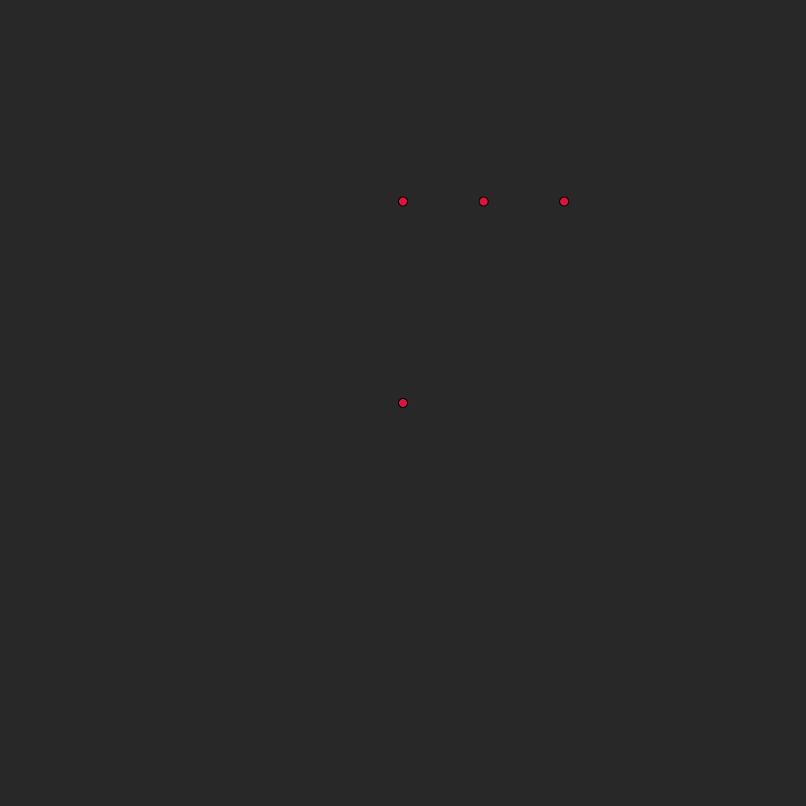

# Simulation Engine

## Examples

|                                                  |                                            |                                            |
|--------------------------------------------------|--------------------------------------------|--------------------------------------------|
|  |       |  |
|           |   |   |

## Running the Examples
The list of current examples can be found in the examples directory. Before running them, make sure that you have Rust's build tool, Cargo, installed ([installation](https://www.rust-lang.org/tools/install)). You can then run them with 
```console
cargo run --release --example {example_name}
```

## Introduction

The goal of this project is to create a general purpose framework for particle based simulations. In reality everything is composed of particles, so it seems reasonable that one should be able to use particle dynamics to simulate (at least to some degree) any kind of phenomenon. Along with this generality of particles, another major advantage of their use is the ability to massively parallelize and distribute the computational workloads that arise when performing simulations.